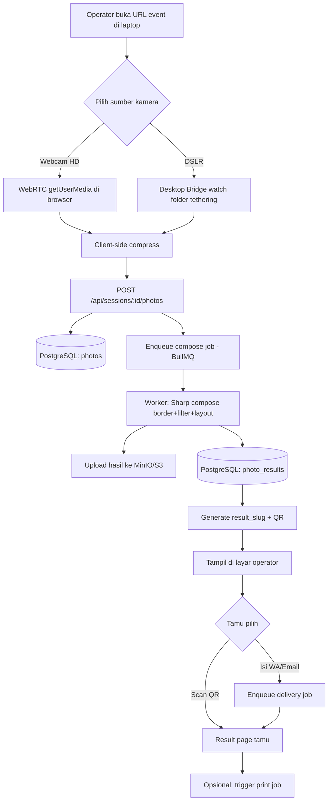
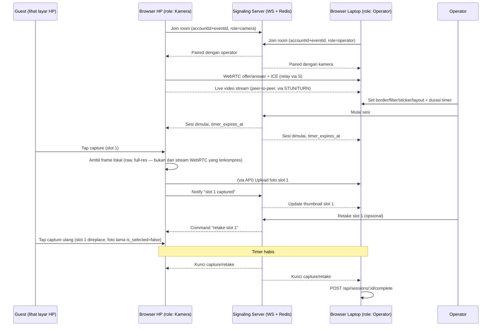

# Architecture — LUMORA

## 1. Prinsip desain

- **Web API tetap tipis.** Route Hono hanya: validasi (Zod) → tulis/baca DB cepat → enqueue job kalau kerjaannya berat. Jangan proses gambar di request/response cycle Next.js — itu tugas `apps/worker`.
- **Operator-assisted, bukan multi-guest broadcast.** Satu event = satu layar operator yang aktif pada satu waktu. Untuk mode capture langsung (FR-01/FR-02) ini menyederhanakan kebutuhan realtime jadi cukup polling. **Pengecualian: FR-14 (Remote Mobile Mirroring) tetap butuh WebSocket penuh** karena ada 2 device yang harus saling sinkron real-time (video stream + timer + command retake) — lihat §4b.
- **Hardware-agnostic di layer yang sama.** Baik webcam browser maupun DSLR (via desktop bridge) berakhir sebagai HTTP POST ke endpoint upload yang sama. Composer engine tidak peduli sumbernya.

## 2. Diagram alur end-to-end



## 3. Modul per aplikasi

### `apps/web` (Next.js 15 + Hono)
- **Admin console**: CRUD event, upload border custom, pilih dari Global Template Library, konfigurasi layout (grid/strip) via JSON editor sederhana.
- **Operator console**: halaman `/operate/[sessionSlug]`, pilih sumber kamera, live preview, tombol capture, dropdown filter (FR-05), tampilan QR dinamis + form WA/Email (FR-06), tombol "Mulai Sesi Baru" yang reset QR lama.
  > **Catatan penting (FR-01)**: dropdown "pilih sumber kamera" mengambil daftar device langsung
  > dari `enumerateDevices()` browser — ini artinya HP yang di-tether ke laptop operator lewat app
  > seperti DroidCam/Iriun (muncul sebagai video input device biasa di OS) otomatis muncul di
  > dropdown yang sama, tanpa butuh integrasi khusus. Jangan buat UI yang mem-filter device
  > berdasarkan nama/vendor — tampilkan semua device video yang terdeteksi apa adanya.
- **Guest result page**: `/r/[resultSlug]`, publik tapi hanya bisa diakses lewat slug acak — view, download, share.
- **API routes (Hono)**: lihat `docs/API.md` untuk kontrak lengkap. Semua endpoint publik (guest-facing) di-rate-limit — lihat `docs/SECURITY.md`.

### `apps/worker` (BullMQ + Redis)
Tiga job queue:
1. **`compose-photo`** — konsumsi raw photos dari satu session, satukan koordinat via `template_config` (layout), terapkan border & filter (Sharp), khusus mode **Photo Strip**: duplikasi kolom kiri ke kanan otomatis sesuai FR-07. Output: file resolusi cetak 4R (300dpi) + thumbnail. Upload ke object storage, tulis row `photo_results`.
2. **`send-delivery`** — kirim link hasil via email (Nodemailer) dan/atau WA (provider TBD, lihat §6).
3. **`retention-cleanup`** — **repeatable job** (bukan Vercel Cron/pg_cron seperti draft awal PRD, karena worker+Redis sudah tersedia di stack). Jadwal harian:
   - Query `sessions` dengan `created_at < now() - interval '30 days'`
   - **Kumpulkan dulu semua `file_url`** dari `photos` dan `photo_results` terkait (join by `session_id`) — ini harus terjadi SEBELUM delete DB, karena `ON DELETE CASCADE` akan menghapus baris beserta referensi file_url-nya.
   - Hapus objek fisik dari object storage berdasarkan daftar `file_url` tadi.
   - Baru delete row `sessions` induk → cascade otomatis membereskan `photos`, `photo_results`, `print_jobs` terkait (FR-09).
   - Log jumlah row & file yang dihapus untuk audit.

### `apps/desktop-bridge` (Tauri) — **baru, mengisi gap FR-02**
- GUI kecil: pilih folder tethering kamera (folder yang di-drop otomatis oleh software DSLR/capture card), pilih event aktif.
- `chokidar` watch folder → begitu file baru muncul → kompres lokal (samakan target ~1.5MB sesuai FR-03) → POST ke `apps/web` dengan Bearer token khusus bridge (lihat `docs/SECURITY.md` §Desktop Bridge Auth).
- Tauri dipilih dibanding Electron karena ukuran installer jauh lebih kecil (sesuai catatan "ukuran aplikasi lebih ringan" di PRD §5).

### `packages/db` (Prisma)
Lihat `docs/DATABASE.md` untuk schema Prisma final hasil terjemahan DDL PRD v3.2.

## 4. Realtime — kenapa tidak butuh websocket (berlaku untuk FR-01/FR-02, TIDAK untuk FR-14)

PRD sebelumnya (draf awal) mengasumsikan galeri live multi-viewer. PRD v3.2 (final) mengubah model jadi **operator-assisted single-screen** — hanya layar operator yang perlu ter-update, dan updatenya dipicu oleh aksi operator sendiri (klik capture, klik "Sesi Baru"). Karena itu cukup:
- TanStack Query `refetchInterval` pendek (mis. 2 detik) saat status sesi `processing`, atau
- Refetch manual dipicu langsung setelah operator klik aksi (optimistic update + invalidate).

Tidak perlu Socket.io/WebSocket untuk mode ini — mengurangi kompleksitas infra secara signifikan.

## 4b. Realtime untuk FR-14 (Remote Mobile Mirroring) — **butuh WebSocket, ini beda kasus**

FR-14 (lihat `docs/PRD-v4.md`) memperkenalkan pairing HP↔laptop dengan live video mirroring — ini **genuinely butuh** koneksi realtime dua arah, tidak bisa diakali dengan polling:

- **Signaling server**: WebSocket server (pakai `ws` di Node, bisa hidup di `apps/web` sebagai custom server atau service kecil terpisah) untuk pertukaran SDP offer/answer + ICE candidates antara HP dan laptop (`RTCPeerConnection`), plus sinkronisasi state sesi: timer start/expire, event "slot N captured", command "retake slot N".
- **Redis pub/sub** dipakai untuk routing pesan signaling kalau nanti `apps/web` dijalankan lebih dari satu instance (horizontal scaling) — untuk MVP single-instance, in-memory routing juga cukup, tapi desain dari awal pakai Redis pub/sub supaya tidak perlu refactor besar nanti.
- **STUN**: bisa pakai publik (`stun:stun.l.google.com:19302`) untuk NAT traversal dasar.
- **TURN**: direkomendasikan self-host `coturn` ditambahkan ke `docker-compose.yml` (konsisten dengan pola self-hosted infra lain di project ini) sebagai fallback kalau P2P langsung gagal karena NAT venue yang ketat. Ini penting — jangan skip TURN, karena WiFi venue (hotel, gedung acara) sering pakai jaringan korporat dengan NAT yang tidak ramah P2P.

### Diagram alur pairing + capture (FR-14)



## 5. Object storage — MinIO

TECH_STACK.md tidak mencantumkan solusi storage apapun, padahal PRD eksplisit butuh tempat simpan file (borders, photos, hasil). Karena seluruh infra lain self-hosted via docker-compose (bukan managed service seperti Supabase), **MinIO** adalah pilihan paling konsisten: S3-compatible API (jadi bisa pakai `@aws-sdk/client-s3` yang standar), mudah ditambahkan sebagai service baru di `docker-compose.yml`:

```yaml
minio:
  image: minio/minio:latest
  command: server /data --console-address ":9001"
  ports:
    - "9000:9000"
    - "9001:9001"
  environment:
    MINIO_ROOT_USER: ${S3_ACCESS_KEY}
    MINIO_ROOT_PASSWORD: ${S3_SECRET_KEY}
  volumes:
    - minio_data:/data
```

Kalau nanti mau pindah ke AWS S3/Cloudflare R2 di production, tidak perlu ganti kode — cukup ganti `S3_ENDPOINT`.

## 5b. TURN server — coturn (untuk FR-14)

WebRTC P2P antara HP dan laptop butuh NAT traversal. STUN publik cukup untuk kasus jaringan
sederhana, tapi WiFi venue (hotel/gedung acara) sering pakai NAT yang lebih ketat. Tambahkan
`coturn` ke `docker-compose.yml`:

```yaml
coturn:
  image: coturn/coturn:latest
  network_mode: host
  volumes:
    - ./coturn.conf:/etc/coturn/turnserver.conf
```

Konfigurasi minimal `coturn.conf` perlu `listening-port`, `realm`, dan kredensial (`user=...:...`
atau `use-auth-secret` dengan shared secret) — kredensial ini dipakai client saat build
`RTCPeerConnection` config (`iceServers`).

## 6. Keputusan terbuka (perlu konfirmasi dari kamu sebelum implementasi)

| Item | Status | Rekomendasi default |
|---|---|---|
| WhatsApp delivery provider | Belum diputuskan, tidak ada di tech stack | Fonnte (lokal, murah) atau WhatsApp Cloud API (resmi Meta, lebih mahal/setup lebih ribet) |
| Auth admin/operator | Tidak ada library di tech stack | JWT via `jose`, disimpan di httpOnly cookie |
| Desktop Bridge framework | Disebut PRD tanpa pilihan final | Tauri (lebih ringan dari Electron) |
| Object storage | Tidak disebutkan | MinIO (self-hosted, S3-compatible) |
| Signaling server (FR-14) | Fitur baru, belum ada di tech stack | WebSocket (`ws`) custom + Redis pub/sub |
| TURN server (FR-14) | Fitur baru, belum ada di tech stack | Self-host `coturn` (evaluasi ulang kalau sering gagal koneksi di lapangan) |
| FR-14 masuk MVP v4 atau v4.1? | Kompleksitas tinggi (WebRTC+signaling+TURN) | Rekomendasi: kerjakan setelah FR-01/FR-02 stabil — lihat `TASKS.md` |

Kalau ada dari poin di atas yang kamu mau ubah, update dulu file ini sebelum suruh Claude Code mulai coding — biar konsisten dari awal.
