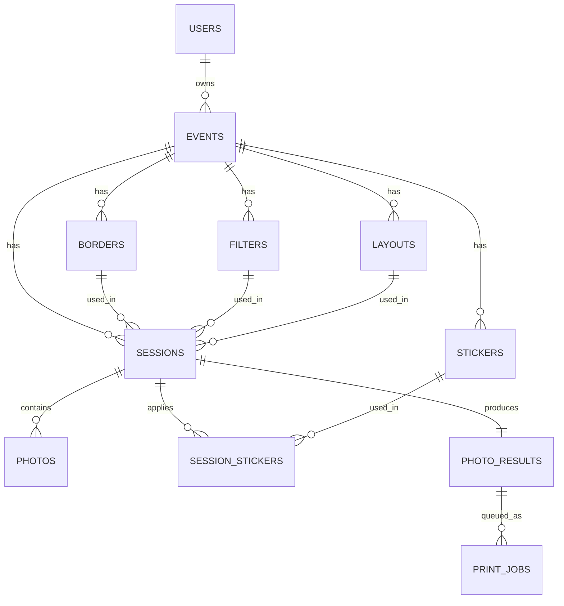

# Database — LUMORA

Schema ini adalah terjemahan langsung dari DDL PostgreSQL di PRD v3.2 §6, diadaptasi ke Prisma v6
idiomatic (camelCase di kode, `@map`/`@@map` menjaga nama tabel/kolom snake_case tetap sama persis
seperti DDL asli — supaya tidak ada breaking change kalau ada tooling lain yang bergantung pada nama
tabel/kolom mentah).

## 1. Entity Relationship Diagram



Catatan penting dari PRD: `borders`, `filters`, `layouts`, **`stickers`** punya `event_id`
**nullable** — kalau `NULL`, berarti itu Global Template milik platform (FR-08), bukan milik event
tertentu.

**Baru di v4** (lihat `docs/PRD-v4.md` FR-10): `stickers` + `session_stickers`. Satu sesi bisa
memakai **0 sampai N sticker sekaligus** (beda dari border/filter/layout yang sifatnya 1:1 per
sesi), makanya butuh tabel join tersendiri, bukan kolom FK langsung di `sessions`.

**Baru di v4 (FR-14 — Remote Mobile Mirroring)**: `sessions` dapat 3 kolom timer
(`timer_duration_seconds`, `timer_started_at`, `timer_expires_at`) dan `photos` dapat `is_selected`
untuk histori retake. **Pairing/room state antara device HP dan laptop TIDAK disimpan di
PostgreSQL** — itu state ephemeral (hanya relevan selama sesi berlangsung), jadi cukup di Redis
dengan TTL, key seperti `pairing:{eventId}`. Jangan bikin tabel Postgres untuk ini, akan jadi
overhead yang tidak perlu untuk data yang sifatnya sementara.

## 2. `packages/db/prisma/schema.prisma`

```prisma
generator client {
  provider = "prisma-client-js"
}

datasource db {
  provider = "postgresql"
  url      = env("DATABASE_URL")
}

enum UserRole {
  admin
  superadmin

  @@map("user_role")
}

enum EventStatus {
  draft
  active
  ended
  archived

  @@map("event_status")
}

enum SessionStatus {
  capturing
  processing
  completed
  failed

  @@map("session_status")
}

enum CaptureSource {
  webcam
  desktop_bridge
  remote_mobile

  @@map("capture_source")
}

enum PrintJobStatus {
  queued
  printing
  done
  failed

  @@map("print_job_status")
}

model User {
  id           String   @id @default(dbgenerated("gen_random_uuid()")) @db.Uuid
  name         String   @db.VarChar(255)
  email        String   @unique @db.VarChar(255)
  passwordHash String   @map("password_hash") @db.VarChar(255)
  role         UserRole @default(admin)
  createdAt    DateTime @default(now()) @map("created_at") @db.Timestamptz()

  events Event[]

  @@map("users")
}

model Event {
  id                String      @id @default(dbgenerated("gen_random_uuid()")) @db.Uuid
  userId            String      @map("user_id") @db.Uuid
  name              String      @db.VarChar(255)
  eventDate         DateTime?   @map("event_date") @db.Date
  status            EventStatus @default(draft)
  sessionSlug       String      @unique @map("session_slug") @db.VarChar(64)
  maxPhotosPerGuest Int?        @map("max_photos_per_guest")
  createdAt         DateTime    @default(now()) @map("created_at") @db.Timestamptz()
  updatedAt         DateTime    @default(now()) @map("updated_at") @db.Timestamptz()

  user     User      @relation(fields: [userId], references: [id], onDelete: Cascade)
  borders  Border[]
  filters  Filter[]
  layouts  Layout[]
  stickers Sticker[]
  sessions Session[]

  @@map("events")
}

model Border {
  id        String   @id @default(dbgenerated("gen_random_uuid()")) @db.Uuid
  eventId   String?  @map("event_id") @db.Uuid
  name      String   @db.VarChar(255)
  imageUrl  String   @map("image_url")
  isActive  Boolean  @default(true) @map("is_active")
  createdAt DateTime @default(now()) @map("created_at") @db.Timestamptz()

  event    Event?    @relation(fields: [eventId], references: [id], onDelete: Cascade)
  sessions Session[]

  @@map("borders")
}

model Filter {
  id        String   @id @default(dbgenerated("gen_random_uuid()")) @db.Uuid
  eventId   String?  @map("event_id") @db.Uuid
  name      String   @db.VarChar(100)
  config    Json     @default("{}")
  createdAt DateTime @default(now()) @map("created_at") @db.Timestamptz()

  event    Event?    @relation(fields: [eventId], references: [id], onDelete: Cascade)
  sessions Session[]

  @@map("filters")
}

model Layout {
  id             String   @id @default(dbgenerated("gen_random_uuid()")) @db.Uuid
  eventId        String?  @map("event_id") @db.Uuid
  name           String   @db.VarChar(100)
  photoCount     Int      @map("photo_count")
  templateConfig Json     @default("{}") @map("template_config")
  createdAt      DateTime @default(now()) @map("created_at") @db.Timestamptz()

  event    Event?    @relation(fields: [eventId], references: [id], onDelete: Cascade)
  sessions Session[]

  @@map("layouts")
}

model Session {
  id                   String         @id @default(dbgenerated("gen_random_uuid()")) @db.Uuid
  eventId              String         @map("event_id") @db.Uuid
  borderId             String?        @map("border_id") @db.Uuid
  layoutId             String?        @map("layout_id") @db.Uuid
  filterId             String?        @map("filter_id") @db.Uuid
  guestEmail           String?        @map("guest_email") @db.VarChar(255)
  guestWaNumber        String?        @map("guest_wa_number") @db.VarChar(50)
  captureSource        CaptureSource? @map("capture_source")
  timerDurationSeconds Int?           @map("timer_duration_seconds") // khusus FR-14 remote_mobile
  timerStartedAt       DateTime?      @map("timer_started_at") @db.Timestamptz()
  timerExpiresAt       DateTime?      @map("timer_expires_at") @db.Timestamptz()
  status               SessionStatus  @default(capturing)
  createdAt            DateTime       @default(now()) @map("created_at") @db.Timestamptz()
  completedAt          DateTime?      @map("completed_at") @db.Timestamptz()

  event           Event             @relation(fields: [eventId], references: [id], onDelete: Cascade)
  border          Border?           @relation(fields: [borderId], references: [id])
  layout          Layout?           @relation(fields: [layoutId], references: [id])
  filter          Filter?           @relation(fields: [filterId], references: [id])
  photos          Photo[]
  photoResult     PhotoResult?
  sessionStickers SessionSticker[]

  @@map("sessions")
}

enum StickerAnchor {
  forehead
  left_eye
  right_eye
  nose
  mouth
  chin
  left_ear
  right_ear
  full_face

  @@map("sticker_anchor")
}

model Sticker {
  id             String        @id @default(dbgenerated("gen_random_uuid()")) @db.Uuid
  eventId        String?       @map("event_id") @db.Uuid
  name           String        @db.VarChar(255)
  imageUrl       String        @map("image_url")
  anchorPoint    StickerAnchor @map("anchor_point")
  defaultScale   Float         @default(1.0) @map("default_scale")
  defaultOffsetX Float         @default(0) @map("default_offset_x")
  defaultOffsetY Float         @default(0) @map("default_offset_y")
  isActive       Boolean       @default(true) @map("is_active")
  createdAt      DateTime      @default(now()) @map("created_at") @db.Timestamptz()

  event           Event?            @relation(fields: [eventId], references: [id], onDelete: Cascade)
  sessionStickers SessionSticker[]

  @@map("stickers")
}

// Join table: satu sesi bisa pakai 0..N sticker sekaligus (beda dari border/filter/layout yang 1:1)
model SessionSticker {
  id        String   @id @default(dbgenerated("gen_random_uuid()")) @db.Uuid
  sessionId String   @map("session_id") @db.Uuid
  stickerId String   @map("sticker_id") @db.Uuid
  offsetX   Float?   @map("offset_x")
  offsetY   Float?   @map("offset_y")
  scale     Float?
  createdAt DateTime @default(now()) @map("created_at") @db.Timestamptz()

  session Session @relation(fields: [sessionId], references: [id], onDelete: Cascade)
  // Sengaja TIDAK onDelete: Cascade dari sisi sticker — kalau admin coba hapus sticker yang masih
  // dipakai sesi lama, biarkan gagal (Restrict default Prisma). Admin harus nonaktifkan
  // (`is_active = false`), bukan hard-delete, supaya sesi lama tidak kehilangan referensi.
  sticker Sticker @relation(fields: [stickerId], references: [id])

  @@map("session_stickers")
}

model Photo {
  id            String   @id @default(dbgenerated("gen_random_uuid()")) @db.Uuid
  sessionId     String   @map("session_id") @db.Uuid
  fileUrl       String   @map("file_url")
  sequenceOrder Int      @map("sequence_order")
  isSelected    Boolean  @default(true) @map("is_selected") // false = sudah di-retake, disimpan untuk histori/analytics
  createdAt     DateTime @default(now()) @map("created_at") @db.Timestamptz()

  session Session @relation(fields: [sessionId], references: [id], onDelete: Cascade)

  @@map("photos")
}

model PhotoResult {
  id           String    @id @default(dbgenerated("gen_random_uuid()")) @db.Uuid
  sessionId    String    @unique @map("session_id") @db.Uuid
  resultSlug   String    @unique @map("result_slug") @db.VarChar(32)
  fileUrl      String    @map("file_url")
  thumbnailUrl String?   @map("thumbnail_url")
  expiresAt    DateTime? @map("expires_at") @db.Timestamptz()
  viewCount    Int       @default(0) @map("view_count")
  createdAt    DateTime  @default(now()) @map("created_at") @db.Timestamptz()

  session   Session    @relation(fields: [sessionId], references: [id], onDelete: Cascade)
  printJobs PrintJob[]

  @@index([resultSlug])
  @@map("photo_results")
}

model PrintJob {
  id            String         @id @default(dbgenerated("gen_random_uuid()")) @db.Uuid
  photoResultId String         @map("photo_result_id") @db.Uuid
  status        PrintJobStatus @default(queued)
  printedAt     DateTime?      @map("printed_at") @db.Timestamptz()
  createdAt     DateTime       @default(now()) @map("created_at") @db.Timestamptz()

  photoResult PhotoResult @relation(fields: [photoResultId], references: [id], onDelete: Cascade)

  @@map("print_jobs")
}
```

**Perubahan dari DDL asli**: menambahkan enum (`UserRole`, `EventStatus`, `SessionStatus`,
`CaptureSource`, `PrintJobStatus`) untuk type-safety di level Prisma. Nilai enum sama persis
dengan yang tersirat di DDL asli (`default 'draft'`, `default 'capturing'`, dst) — tidak ada
value baru yang ditambahkan tanpa dasar dari PRD.

## 3. Retention job — urutan operasi yang benar

⚠️ Kesalahan umum: delete row `sessions` duluan baru coba hapus file — **jangan**, karena
`ON DELETE CASCADE` akan menghapus baris `photos`/`photo_results` beserta kolom `file_url`-nya
sebelum kamu sempat baca urlnya.

Urutan yang benar:
```
1. SELECT file_url dari photos + photo_results (+ thumbnail_url) WHERE session terkait
   created_at < now() - interval '30 days'
2. Hapus objek fisik tsb dari MinIO/S3
3. DELETE FROM sessions WHERE created_at < now() - interval '30 days'
   → cascade otomatis bersihkan photos, photo_results, print_jobs
4. Log jumlah row & file yang berhasil/gagal dihapus
```

## 4. Migration & seed

```bash
pnpm --filter db prisma migrate dev --name init
pnpm --filter db prisma db seed
```

Seed wajib mengisi minimal 1 baris di `borders`, `filters`, `layouts` dengan `event_id = NULL`
sebagai Global Template Library default (FR-08), supaya event baru langsung punya pilihan
default tanpa admin harus upload dulu.
